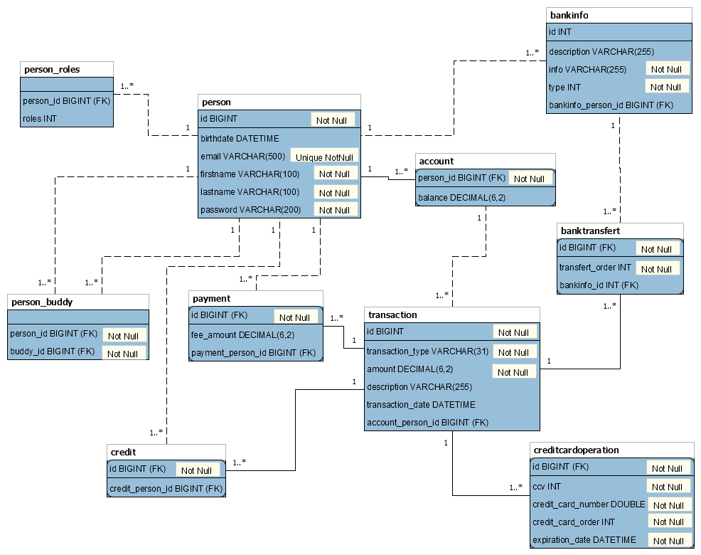

# Pay My Buddy
API REST application for managing an payment system. 
This app use SPRINT BOOT, My sql.

## Getting Started

Endpoint : http://localhost:8080/
Actuator : http://localhost:8090/

## Prerequisites

What things you need to install the software and how to install them

- Java 1.8
- Maven 3.6.2
- Spring Boot 2.2.6
- My SQL

# Installation
Execute drop.sql and create.sql

#Class Diagram

#MPD

# URI
##signup

POST http://localhost:8080/signup

boby example :

{
    "firstName": "May",
    "lastName": "Day",
    "birthdate": "1985-10-24",
    "email": "may.day@dangeurementvotre.fr",
    "password": "SPECTRE"
}

##signin

POST http://localhost:8080/signin

boby example :

{
    "email": "james.bond@mi6.uk",
    "password": "abc"
}

##list of persons

GET http://localhost:8080/persons

##Create a Buddy

POST http://localhost:8080/buddy

boby example :

{
    "myEmail": "james.bond@mi6.uk",
    "buddyEmail": "vesper.lynd@casinoroyal.com",
    "buddyFirstname": "",
    "buddyLastName": ""
}

##list my buddy

GEST http://localhost:8080/buddy/{email}

##operate payement betwwen buddys

POST http://localhost:8080/transaction/buddy

boby example :

{
    "myEmail": "james.bond@mi6.uk",
    "buddyEmail": "vesper.lynd@casinoroyal.com",
    "description": "Il était une fois une transaction",
    "transactionAmount": "10",
    "feeAmount": ""
}

##list bank info for a person

GET http://localhost:8080/bankinfo/{email}

##create bankinfo for a person

POST http://localhost:8080/bankinfo

boby example :
    {
  
        "type": 1,
        "info": "IBAN",
        "description": "abcdef",
        "person": {
              "email": "james.bond@mi6.uk"
        }
    }
    
##credit car operation

POST http://localhost:8080/transaction/creditcard/{email}

boby example :

{
	"creditCardNumber": "1234567890123456",
	"expirationDate" :"2020-12-31",
	"ccv" : "123",
	"description" : "Operation par CB",
	"amount" : "1000"
}

##transfert money to the bank

POST http://localhost:8080/transaction/bank/{email}

boby example :

{
	"description" : "virement à la banque",
	"amount" : "500",
    "bankinfo": {
              "id": "2"
        }
}
